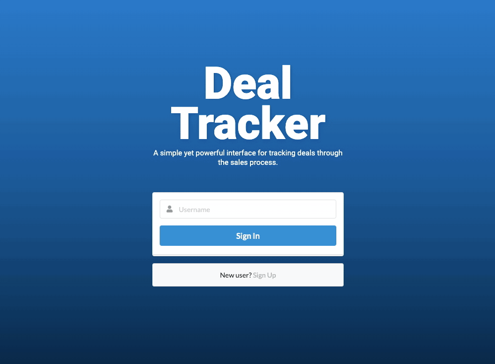

## Deal Tracker
## Description
> Deal Tracker is an application that makes it easy for sales executives to track deals through the sales life cycle.
## Table of Contents
* [Installation](#installation)
* [Usage](#usage)
* [License](#license)
* [Team](#team)
* [Questions](#questions)

## Installation
#### Please follow this command to install npm dependencies:
> npm i
## Usage
> Enables the user to: create, track, update and delete deals.

## Team
Amanda Cerjak: [acerjak](https://api.github.com/users/acerjak "GitHub Profile")

Ian Kirby: [vertjames](https://github.com/vertjames "GitHub Profile")

Logan Morris: [Logan96M](https://github.com/Logan96M "GitHub Profile")

Jordan Muliaman: [jmuliaman97](https://github.com/jmuliaman97 "GitHub Profile")

## License

## Questions
> Please let us know if you have any questions!

***
#### Created June 2020